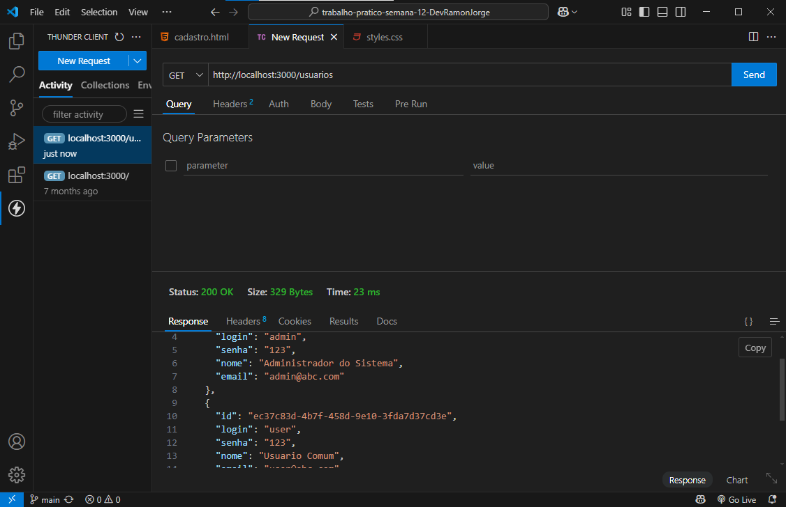
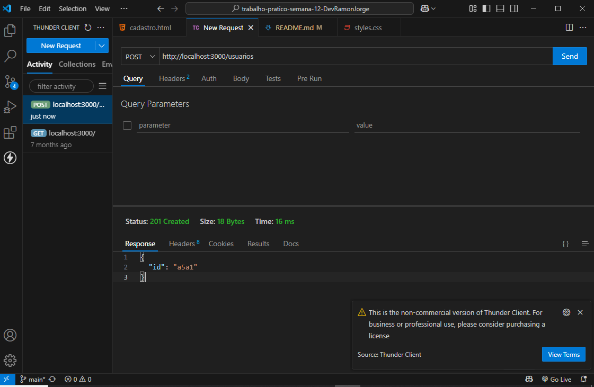
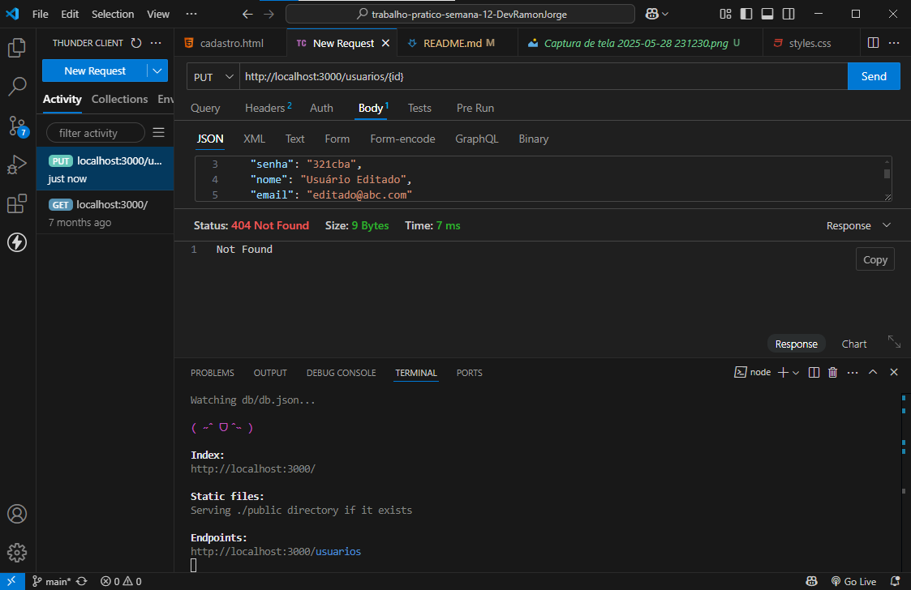
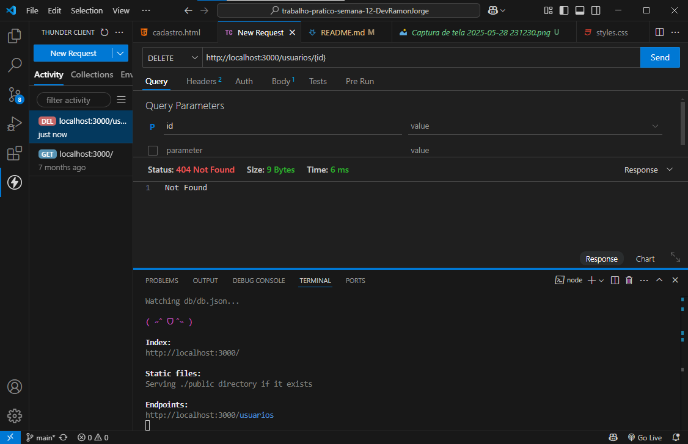
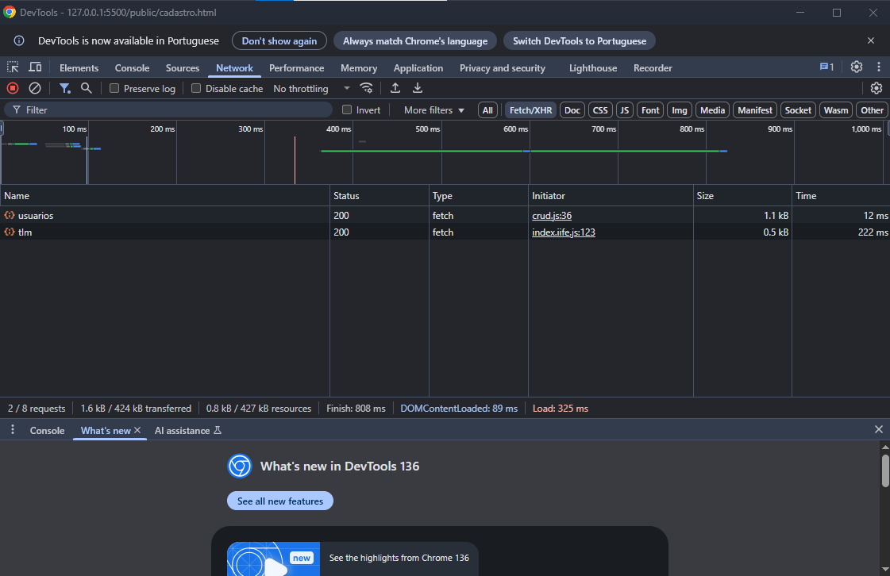
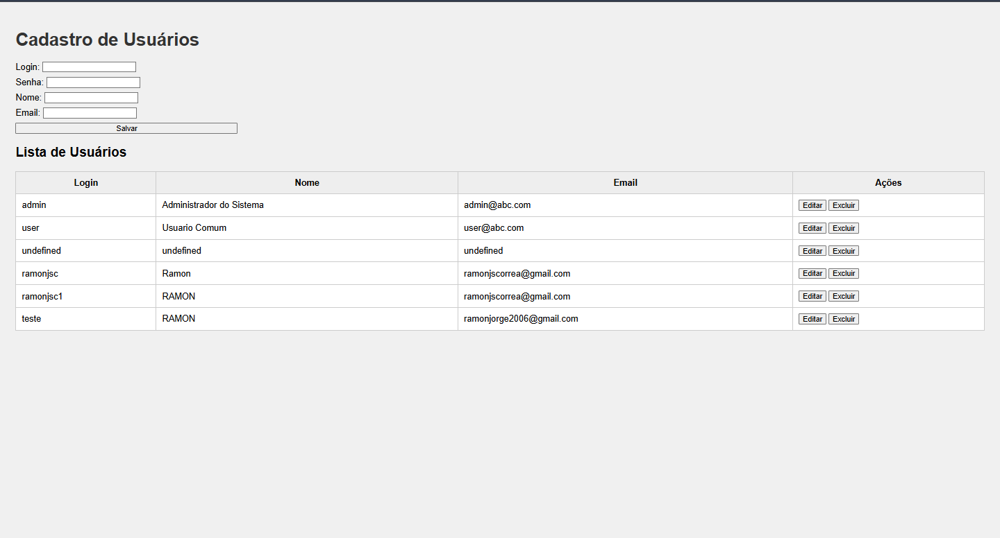

# Trabalho Prático - Semana 11

Nessa etapa, vamos evoluir o projeto anterior e contemplar um ambiente de desenvolvimento mais completo, típico de equipes profissionais. Nesse processo, vamos utilizar um **servidor backend simulado** com o **JSON Server** baseado em APIs RESTful. Um arquivo JSON funcionará como banco de dados e será processado pelo JSON Server que expõe uma API RESTful no servidor.

## Informações do trabalho

- **Nome**: Ramon Jorge da Silva Correa  
- **Matrícula**: 1541846  
- **Proposta de projeto escolhida**: Cadastro de usuários  
- **Breve descrição sobre seu projeto**: O projeto consiste em uma aplicação que permite listar, visualizar, cadastrar, editar e excluir usuários, utilizando um servidor local com JSON Server e interface construída com HTML, CSS e JavaScript puro.

---

## Prints e Evidências

### ✅ Print do teste da API com visualização do JSON
📷 Inclua aqui uma captura de tela acessando a URL `http://localhost:3000/usuarios` no navegador:




---

### ✅ Print da aba NETWORK com requisições Fetch/XHR
📷 Inclua aqui uma captura de tela do painel Network do navegador após ações como listar ou cadastrar usuários:


---

## Estrutura de Dados Utilizada (`db/db.json`)

```json
{
  "usuarios": [
    {
      "id": "187cb7e5-e097-4224-8bc7-b610c855e2b1",
      "login": "admin",
      "senha": "123",
      "nome": "Administrador do Sistema",
      "email": "admin@abc.com"
    },
    {
      "id": "ec37c83d-4b7f-458d-9e10-3fda7d37cd3e",
      "login": "user",
      "senha": "123",
      "nome": "Usuario Comum",
      "email": "user@abc.com"
    }
  ]
}


Ok